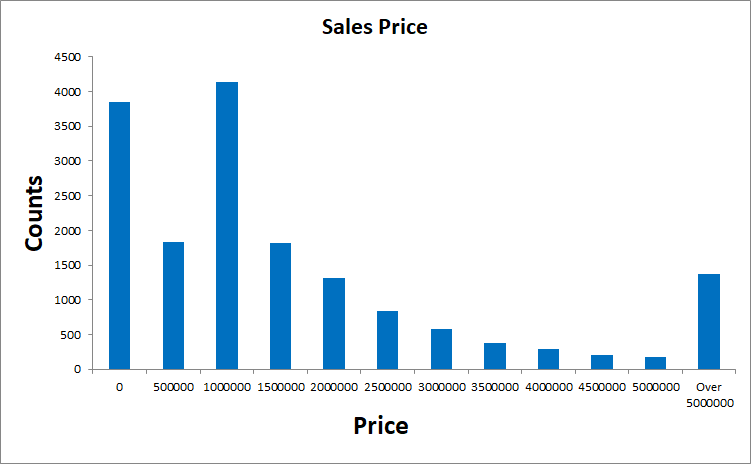
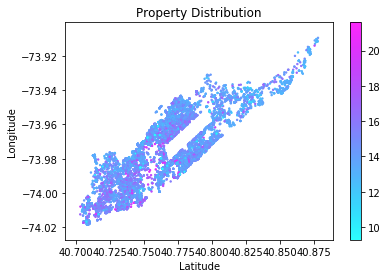
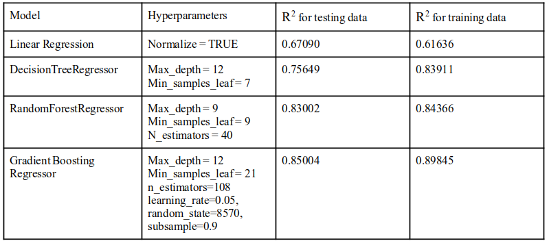
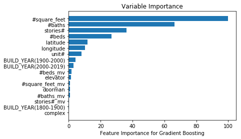
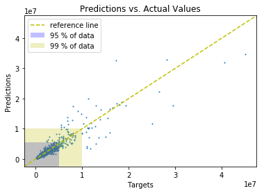

README.md

# Apartment Sale Price Prediction
This is a course project for NYU DS-GA-1001. (Backup)
## 1. Motivation
The real estate market is always fluctuating, evaluating the apartment sale prices is difficult but quite useful for both buyer and sellers (renters and owners). Therefore, the goal of this project is to design a real estate estimation system based on past sales data for Streeteasy.com.
## 2. Data
The dataset contains transaction records only from October 2017 to September 2018. Missing values in the target variable (sale price) are deleted. We also excluded sale prices under $10,000 because it is highly unlikely these prices reflected the true value of the property. 12,517 records were found in total.

Colorbar: Price (million $)

## 3. Methods
We use *selenium* and *time* library to srape webpage. *googlesearch* was used for additional information search.he raw HTML page was then parsed by *BeautifulSoup*. Coordinates data were obtained by *geopy* library with *Nominatim*, an open source geocoding from OpenStreetMap data.

The real world data were messy. The features we have collected are: 
* sale months, 
* apartments built time, 
* accessories, 
* apartment sizes (unit: square feet), 
* number of bedrooms and bathrooms, 
* number of stories and number of units in the building, 
* latitude and longitude.

## 4. Results

## Contributions:
Most of the work are evenly distributed.
**Jieyu Lu**: Notebooks to scrape the data and geocoding. Set up of the machine learning framework (model selection). Plotting of hyper-parameter searching and feature importance, paper write-up
**Dongning Fang**: Data cleaning and processing, scraping the data, hyper-parameter searching, analysis and paper write-up
**Yuxin Tang**: Data cleaning and processing, scraping the data, hyper-parameter searching, analysis and paper write-up
**Jiayu Qiu**:  Data cleaning and processing, scraping the data , hyper-parameter searching, analysis and paper write-up
